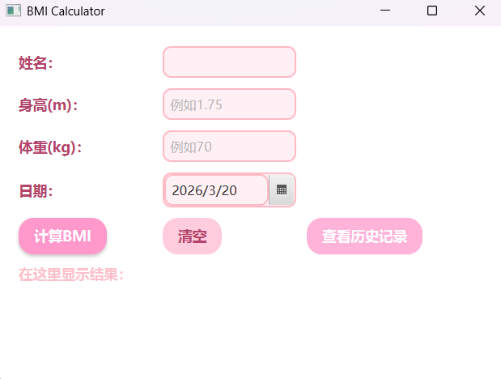

**BMI 计算器 — Java 版**

一个支持图形界面和命令行的 BMI 计算器。输入姓名、身高、体重、日期，自动计算 BMI 并给出健康建议，记录自动保存。

**功能特点**
- 两种方式：JavaFX 图形界面 / 命令行
- 根据中国标准给出健康建议（偏瘦/正常/偏胖/肥胖）
- 历史记录自动保存到 records.txt
- 图形界面粉色系，CSS 样式，按钮悬停效果
- 处理输入异常、日期错误、文件读写失败

**技术栈**
Java 11+ / JavaFX / 文件 I/O / CSS

**如何运行**
图形界面（JavaFX）
需要配置 JavaFX（JDK 11+ 不自带）。
IntelliJ IDEA：导入项目 → 添加 JavaFX 库 → VM options 添加 `--module-path /path/to/javafx-sdk/lib --add-modules javafx.controls,javafx.fxml` → 运行 `BMICalculatorGUI`
**命令行：**
bash
  javac --module-path /path/to/javafx-sdk/lib --add-modules javafx.controls,javafx.fxml BMICalculatorGUI.java
  java --module-path /path/to/javafx-sdk/lib --add-modules javafx.controls,javafx.fxml BMICalculatorGUI
**命令行版本（无需 JavaFX）**
  javac Hello.java
  java Hello
  
  **未来计划**
  添加图表展示 BMI 变化趋势
  支持导出 CSV 文件

  **作者**
  momomo714 | GitHub
  
  
  
bash
javac Hello.java
java Hello
